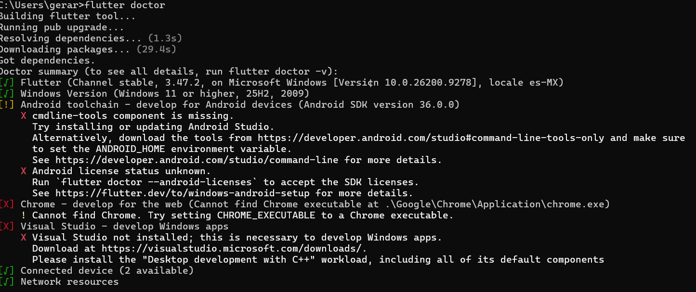
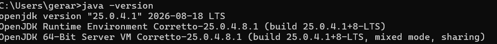
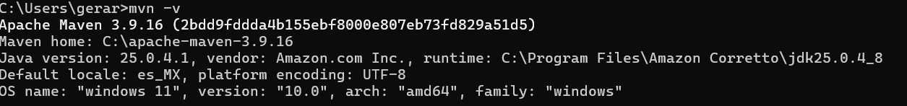
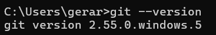
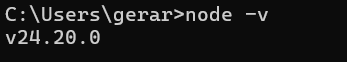
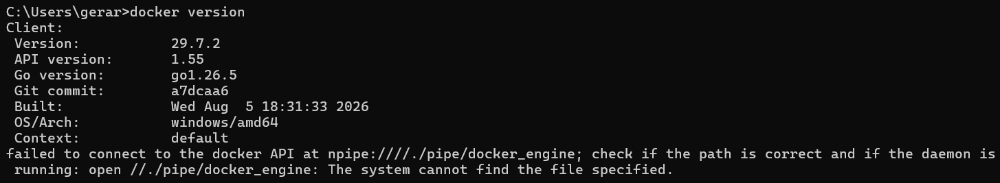
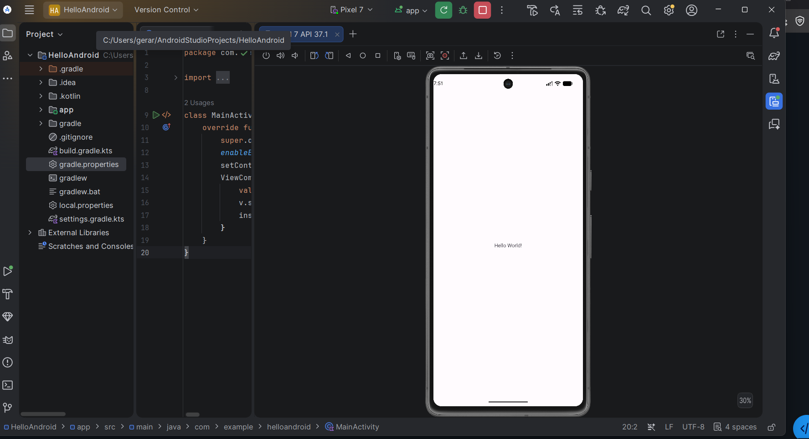
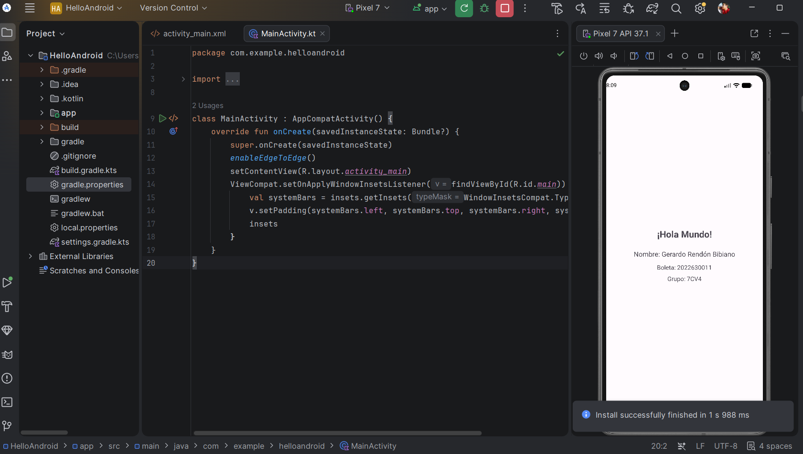
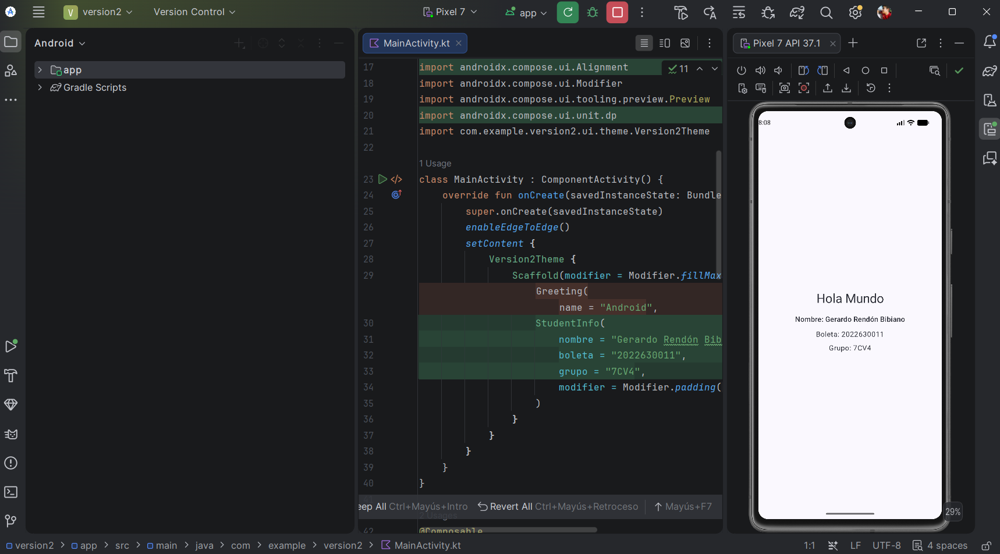
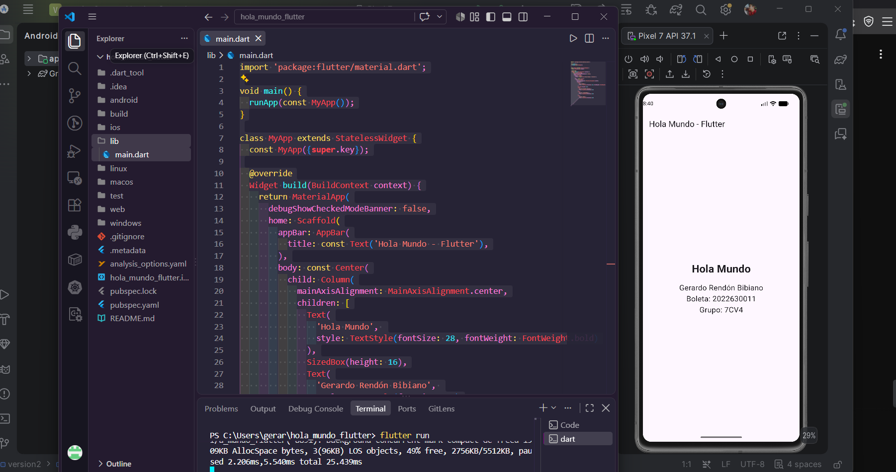

# Práctica 1: Instalación y Funcionamiento de los Entornos Móviles

**Alumno:** Gerardo Rendon Bibiano
**Boleta:** 2022630011
**Grupo:** 7CV4
**Materia:** Desarrollo de aplicaciones móviles nativas (ESCOM - IPN)  

---

## 1. Tabla de Herramientas Instaladas

A continuación, se detalla el entorno de desarrollo configurado:

| Herramienta | Versión Instalada | Sistema Operativo |
| :--- | :--- | :--- |
| **Java (JDK - Amazon Corretto)** | [25.0.4.1] | Windows |
| **Apache Maven** | [3.9.16] | Windows |
| **Git** | [Ej. 2.55.0] | Windows |
| **Flutter SDK** | [Ej. 3.47.2] | Windows |
| **Node.js** | [24.20.0] | Windows |
| **Docker Desktop** | [Ej. 29.7.2] | Windows |
| **Android Studio** | [Koala] | Windows |

---

## 2. Descripción de Herramientas y Proyectos

**Herramientas Instaladas:**
* **Android Studio & JDK:** Entorno principal para compilar las versiones nativas en Kotlin.
* **Maven & Git:** Herramientas para gestión de dependencias y control de versiones del código.
* **Flutter, Node.js & Docker:** Entornos y plataformas auxiliares para desarrollo multiplataforma y ejecución de contenedores y servidores locales.

**Proyectos Desarrollados:**
La práctica consta de tres aplicaciones "Hola Mundo" que muestran datos personales usando diferentes enfoques de construcción de interfaces móviles:
1. `hola_mundo_xml`: Proyecto nativo de Android usando layouts en XML (Views).
2. `hola_mundo_compose`: Proyecto nativo de Android usando Jetpack Compose y funciones @Composable.
3. `hola_mundo_flutter`: Proyecto multiplataforma usando el framework Flutter con el lenguaje Dart.

---

## 3. Instrucciones de Instalación y Ejecución

**Proceso de Instalación (Windows):**
1. Se descargaron los ejecutables de Android Studio, Node.js y Docker Desktop, procediendo con la instalación estándar.
2. Se extrajeron los binarios de Maven y Flutter, y se agregaron las rutas (`bin`) a las Variables de Entorno (`PATH`) de Windows.
3. Se verificó la instalación mediante comandos en la terminal (`java -version`, `flutter doctor`, etc.).
4. En Android Studio, se configuró un Emulador (Pixel 7 - API 34).

**Ejecución de las Aplicaciones:**
* **Versiones Nativas (XML y Compose):** Abrir la carpeta del proyecto correspondiente en Android Studio, esperar a que finalice la sincronización de Gradle y presionar el botón "Run (▶)" seleccionando el emulador.
* **Versión Flutter:** Abrir la terminal, navegar a la carpeta `hola_mundo_flutter` y ejecutar el comando `flutter run` con el emulador previamente encendido.

---

## 4. Capturas de Pantalla del Proceso

**Configuración y Terminales:**

**Aplicaciones "Hola Mundo" Ejecutándose:**

---

## 5. Dificultades Encontradas y Soluciones

* **Dificultad:** Al intentar ejecutar `node -v` y `flutter` por primera vez, la terminal no reconocía los comandos.
* **Solución:** Se tuvo que editar manualmente las variables de entorno del sistema (`PATH`) en Windows para incluir las rutas correctas hacia las carpetas `bin` de ambas herramientas, y posteriormente reiniciar la terminal para que aplicaran los cambios[cite: 1].
* **Dificultad:** La primera ejecución de la aplicación en Flutter tardó mucho tiempo, mostrando advertencias de Gradle.
* **Solución:** Se permitió que el proceso finalizara (descarga de dependencias y empaquetado inicial) comprobando que las advertencias no afectaban la compilación final.

---

## 6. Conclusiones y Comparación de Enfoques

**(Comparación entre XML, Compose y Flutter)**

Al analizar los tres enfoques de desarrollo para construir la misma interfaz, se observan diferencias significativas. 

El enfoque tradicional de **Android nativo con Views (XML)** requiere separar la lógica (Kotlin) del diseño visual (XML). Esto implica manejar más archivos y escribir código más verboso (como LinearLayout o ConstraintLayout) para acomodar elementos simples, lo que hace que la cantidad de código sea mayor y la curva de aprendizaje del diseño visual sea ligeramente más lenta.

Por otro lado, **Jetpack Compose** moderniza el desarrollo nativo al usar un enfoque declarativo completamente en Kotlin. La cantidad de código se reduce drásticamente, ya que la interfaz se construye usando funciones propias (`@Composable`) y modificadores en el mismo lugar, agilizando el diseño de la interfaz y la mantenibilidad.

Finalmente, **Flutter** ofrece una experiencia de desarrollo muy fluida. Al utilizar Dart y un sistema basado enteramente en *Widgets*, la estructura del código visual es muy anidada (árbol de widgets), pero altamente intuitiva una vez que se comprende. La principal ventaja de Flutter es su facilidad de desarrollo y la capacidad de realizar recargas rápidas (*Hot Reload*), permitiendo ver cambios al instante sin necesidad de recompilar toda la aplicación, además de que el mismo código sirve para múltiples plataformas.