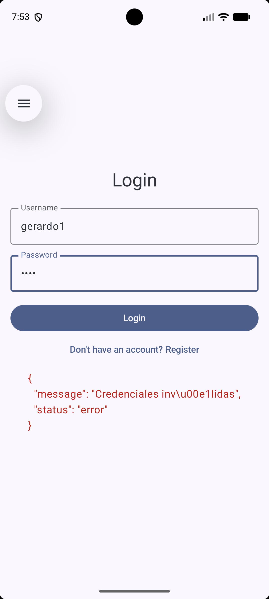
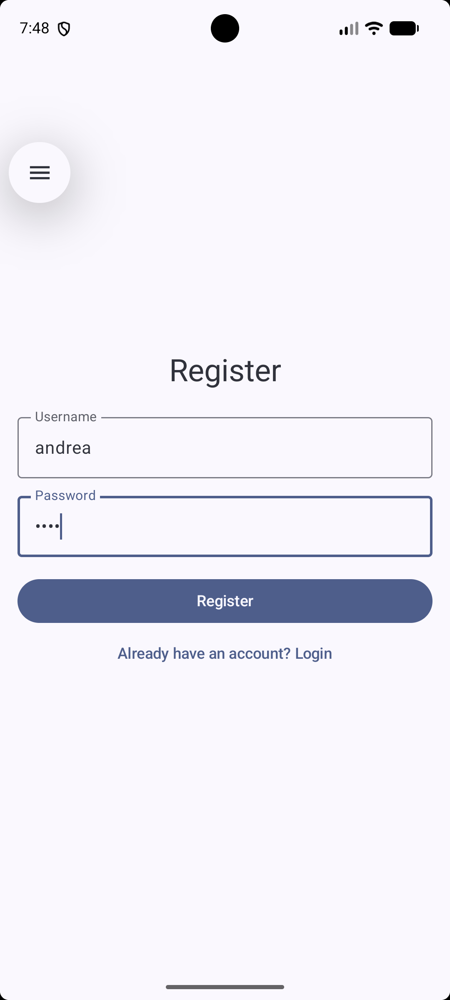
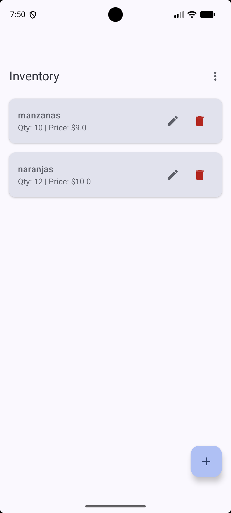
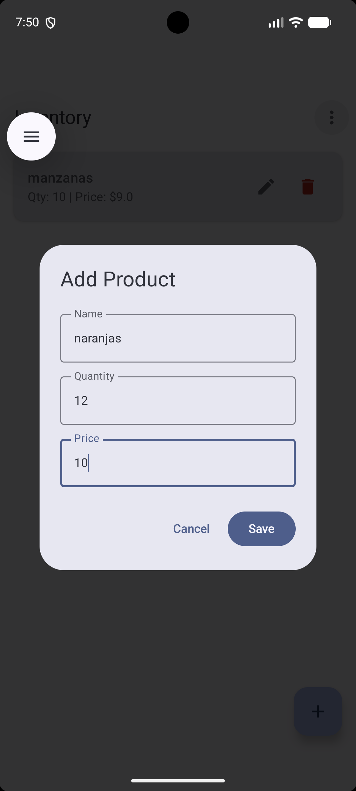
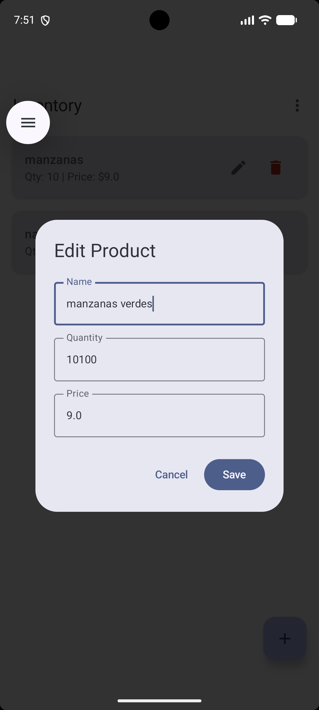
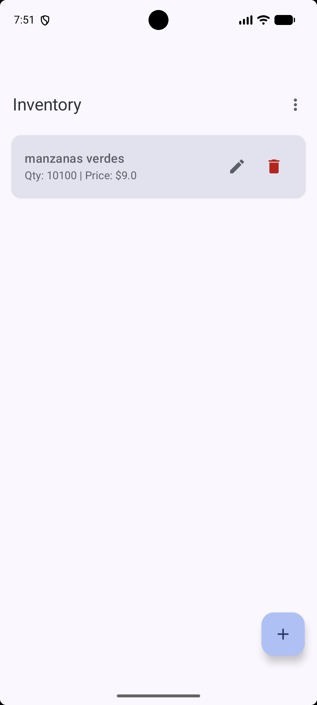

# Instituto Politécnico Nacional
## Escuela Superior de Cómputo

**Unidad de aprendizaje:** Desarrollo de aplicaciones móviles nativas  
**Profesor:** Gabriel Hurtado Avilés  
**Alumno:** Gerardo Rendón Bibiano 
**Boleta:** 2022630011  
**Grupo:** 7CV4  
**Fecha de entrega:** 18 de septiembre de 2026  

---

## Introducción
La presente práctica consiste en el desarrollo de una aplicación móvil en Android desarrollada para la gestión de un inventario, la cual se comunica con un backend REST dockerizado. Para el desarrollo del cliente móvil se utilizó **Kotlin** por ser el lenguaje estándar y moderno recomendado por Google, junto con **Jetpack Compose** para la construcción de una interfaz de usuario declarativa, lo que permite un manejo de estados más eficiente. La comunicación HTTP se implementó mediante **Retrofit** y **Gson**, facilitando el consumo de los servicios web y la serialización de objetos JSON. Del lado del servidor, se empleó **Flask** (Python) para exponer una API REST ligera y segura.

Es importante destacar que **este proyecto parte del repositorio de base proporcionado en la rúbrica, perteneciente del profesor** (`https://github.com/gabrielhuav/Flask-Compose-Login-API`), el cual fue clonado inicialmente. Sobre esta base, se realizaron aportaciones y modificaciones sustanciales:
1. En el backend (`app.py`), se integró el modelo de base de datos para los Productos, relacionándolos con los Usuarios, y se implementó la seguridad mediante tokens (sesiones seguras con expiración) para proteger las operaciones CRUD.
2. En la aplicación móvil, se construyó toda la capa de red agregando las interfaces de `ApiService` y las Data Classes (`AuthRequest`, `AuthResponse`, `Product`, `ProductResponse`).
3. Se implementó un `ViewModel` para gestionar los estados de carga y errores de la UI, y se desarrollaron las pantallas funcionales (`LoginScreen`, `RegisterScreen`, `InventoryScreen`) utilizando Navigation Compose.

## Desarrollo

### Conceptos de Backend REST dockerizado
* **Docker:** Es una herramienta que permite empaquetar, distribuir y ejecutar aplicaciones junto con todas sus dependencias (librerías, frameworks y configuraciones) en cualquier sistema operativo, llamadas contenedores, de tal manera que funcione en cualquier entorno, eliminando el clásico problema de "en mi máquina sí funciona".
* **Imagen y contenedor:** Una **imagen** es una plantilla que no se puede modificar, de solo lectura, que contiene el código, las bibliotecas y las herramientas necesarias para que una aplicación se ejecute. Un **contenedor** Es un entorno con los recursos necesarios para correr una imagen.
* **Dockerfile:** Es un archivo de texto que contiene una serie de instrucciones (`FROM`, `WORKDIR`, `COPY`, `RUN`, `CMD`) para que docker pueda acoplar una imagen.
* **docker-compose.yml:** Es un archivo de configuración en formato YAML que permite definir los distintos parametros y herramientas que un docker necesita.
* **Backend o servicio REST:** Es la arquitectura de software que corre del lado del servidor y gestiona la lógica de negocio. manda los distintos recursos a través de URLs (endpoints) utilizando los verbos estándar del protocolo HTTP (GET, POST, PUT, DELETE) y se comunica con los clientes, enviando y recibiendo datos, generalmente en formato JSON.
* **ORM y base de datos:** Un ORM (Object-Relational Mapping) es una forma de programación que permite cominicarse con una base de datos relacional utilizando el paradigma orientado a objetos, evitando escribir peticiones SQL. 

### Documentación de la API (Endpoints)
* **POST `/register`**: Recibe un cuerpo JSON con `username` y `password`. Registra un nuevo usuario en la base de datos aplicando un hash seguro a la contraseña mediante bcrypt. Retorna código 201 en caso de éxito o 400 si el usuario ya existe.
* **POST `/login`**: Autentica al usuario validando sus credenciales. Retorna código 200 junto con un token firmado criptográficamente que debe usarse para las peticiones posteriores.
* **POST `/products`**: *(Requiere Token en Header)* Recibe `name`, `quantity` y `price`. Crea un nuevo producto asignado al inventario del usuario que realiza la petición.
* **GET `/products`**: *(Requiere Token en Header)* Retorna un JSON con la lista completa de productos pertenecientes al usuario autenticado.
* **PUT `/products/{id}`**: *(Requiere Token en Header)* Recibe los datos a actualizar y modifica la cantidad, precio o nombre de un producto específico, validando previamente la propiedad del mismo.
* **DELETE `/products/{id}`**: *(Requiere Token en Header)* Elimina de forma permanente el registro del producto indicado mediante su ID.

### Instrucciones de instalación y ejecución
1. Clonar este repositorio: `git clone https://github.com/Gera120312/AplicacionesMoviles_ESCOM`
2. Entrar a la carpeta del backend: `cd CRUD/Practica2/Docker-Flask/ORM`
3. Ejecutar el contenedor: `docker compose up --build`
4. Para la app móvil, abrir la carpeta `CRUD/Practica2/Android/FlaskLogin` en Android Studio. Dar permisos de internet en el `AndroidManifest.xml` (`android:usesCleartextTraffic="true"`) y compilar en el emulador. La IP base configurada para conectarse a la API local desde el emulador es `http://10.0.2.2:5000`.

### Capturas de Pantalla

#### 1. Autenticación y Manejo de Errores

#### 2. Operaciones CRUD

## Conclusiones
Durante el desarrollo de esta práctica, se presentaron diversos retos técnicos que ayudaron me ayudaron a entender un poco mas la virtualización y consumo de servicios web. 

El primer desafío significativo ocurrió al intentar levantar el contenedor del backend en el entorno de Windows. El motor de Docker Desktop devolvía un Error 500 (`dockerDesktopLinuxEngine/_ping`) indicando falta de soporte de virtualización. Aunque la virtualización estaba habilitada a nivel de hardware (BIOS), fue necesario configurar el sistema operativo activando explícitamente las características de Windows: "Plataforma de máquina virtual" y "Subsistema de Windows para Linux (WSL)". Tras realizar esta configuración y reiniciar el equipo, el servicio se ejecutó correctamente en el puerto 5000.

El segundo reto se presentó en la aplicación móvil, específicamente en la capa de red con Retrofit. Al intentar realizar la petición GET para consultar el inventario, la aplicación arrojó una excepción de Gson: `Expected BEGIN_ARRAY but was BEGIN_OBJECT`. Tras depurar y analizar la respuesta de la API, se identificó que el cliente en Kotlin esperaba recibir un arreglo directo (`List<Product>`), pero el backend estaba enviando un objeto JSON que envolvía dicho arreglo (`{"products": [...]}`). La solución consistió en crear una *Data Class* envoltorio (`ProductResponse`) y modificar la firma de la interfaz `ApiService` para mapear la estructura exacta, lo que permitió procesar la respuesta y pintar correctamente la lista mediante Jetpack Compose. 

En conclusión, esta practica me ayudo a como gestionar la comunicación entre un cliente, con una aplicación movil, y un servidor, utilizando los endpoints para segmentar las distintas funcionalidades del backend ademas de utilizar criptografia para que las credenciales del cliente estuvieran protegidas.

## Bibliografía
* Android Developers. (2026). *Jetpack Compose UI App Development*. Google. Recuperado de https://developer.android.com/compose
* Android Developers. (2026). *Connect to the network using HTTP*. Google. Recuperado de https://developer.android.com/training/basics/network-ops/connecting
* Docker Inc. (2026). *Docker Compose documentation*. Recuperado de https://docs.docker.com/compose/
* Pallets Projects. (2026). *Flask Documentation (3.1.x)*. Recuperado de https://flask.palletsprojects.com/
* Square Open Source. (2026). *Retrofit: A type-safe HTTP client for Android and Java*. Recuperado de https://square.github.io/retrofit/
* SQLAlchemy authors and contributors. (2026). *SQLAlchemy Documentation*. Recuperado de https://docs.sqlalchemy.org/