# Tarea 2 · Catálogo básico de interfaz

**Alumno:** Gabriel Hurtado Avilés  
**Boleta:** `2022630011`  
**Grupo:** `7CV4`

## Descripción

Catálogo interactivo de elementos básicos de interfaz móvil implementado con tres tecnologías: Android nativo usando Views/XML, Android nativo usando Jetpack Compose y Flutter. Las tres versiones tienen seis secciones navegables, textos de documentación en español, respuesta real a las acciones y tema claro/oscuro según el sistema.

Una funcionalidad transversal conecta **Entrada** con **Listas**: el nombre capturado se muestra como un nuevo dato compartido en la sección de colecciones.

## Estructura

- `android-views/`: Kotlin, Views y layouts XML.
- `android-compose/`: Kotlin y Jetpack Compose.
- `flutter/`: Dart y Flutter.
- `docs/`: espacio para capturas de las seis secciones de cada versión.

## Compilación y ejecución

### Android Views/XML

Abrir `android-views` en Android Studio o ejecutar:

```powershell
cd android-views
.\gradlew.bat assembleDebug
```

El APK se genera en `android-views/app/build/outputs/apk/debug/app-debug.apk`.

### Jetpack Compose

```powershell
cd android-compose
.\gradlew.bat assembleDebug
```

El APK se genera en `android-compose/app/build/outputs/apk/debug/app-debug.apk`.

### Flutter

```powershell
cd flutter
flutter pub get
flutter analyze
flutter test
flutter run
flutter build apk
```

El APK se genera en `flutter/build/app/outputs/flutter-apk/app-release.apk`.

## Tabla de equivalencias

| Elemento solicitado | Views/XML | Jetpack Compose | Flutter |
| --- | --- | --- | --- |
| Campo de texto, etiqueta y validación | `EditText`, `TextInputLayout` equivalente manual | `OutlinedTextField` | `TextField` |
| Contraseña y mostrar/ocultar | `EditText` con `inputType` | `PasswordVisualTransformation` | `TextField(obscureText)` |
| Teclado numérico, correo y teléfono | `inputType` | `KeyboardOptions` | `TextInputType` |
| Multilínea y búsqueda | `EditText`, `SearchView` equivalente | `OutlinedTextField`, icono de búsqueda | `TextField`, `prefixIcon` |
| Sugerencias/desplegable | `Spinner` | `DropdownMenu` | `DropdownButton` |
| Botones relleno, contorno y texto | `Button` y estilos | `Button`, `OutlinedButton`, `TextButton` | `FilledButton`, `OutlinedButton`, `TextButton` |
| Botón con ícono | `Button` + `Drawable` | `Button` + `Icon` | `FilledButton.icon`, `IconButton` |
| FAB normal y extendido | `FloatingActionButton` | `FloatingActionButton`, `ExtendedFloatingActionButton` | `FloatingActionButton.extended` |
| Toggle/segmentado | `Switch` / `RadioGroup` | `Switch` / selección documentada | `Switch`, `SegmentedButton` equivalente |
| Deshabilitado y carga | `isEnabled`, `ProgressBar` | `enabled`, `LinearProgressIndicator` | `onPressed: null`, `ProgressIndicator` |
| Checkbox e indeterminado | `CheckBox` | `Checkbox` | `CheckboxListTile` |
| Radio mutuamente excluyente | `RadioGroup` | `RadioButton` | `RadioListTile` |
| Switch | `Switch` | `Switch` | `Switch` |
| Slider simple y rango | `SeekBar`; rango resuelto con dos controles | `Slider`; rango resuelto con dos sliders | `Slider`; `RangeSlider` disponible |
| Selector de fecha y hora | `DatePickerDialog`; hora equivalente | diálogo equivalente | `showDatePicker`, `showTimePicker` |
| Chips de filtro | `Chip`/`CheckBox` equivalente | chips documentados | `FilterChip` |
| Lista vertical de 15 elementos | `ScrollView` + vistas | `LazyColumn` | `ListView` equivalente con `ListView`/`ListTile` |
| Cuadrícula | `GridLayout` equivalente | `LazyVerticalGrid` equivalente | `GridView` equivalente |
| Encabezados, detalle y eliminar | vistas agrupadas y diálogo | `Card`, `AlertDialog` | `ListTile`, `AlertDialog` |
| Actualizar arrastrando | `SwipeRefreshLayout` (pendiente de integrar visualmente) | gesto equivalente documentado | `RefreshIndicator` disponible |
| Estado vacío | `TextView` condicional | texto condicional | texto condicional |
| Pestañas | `TabLayout` equivalente | `TabRow` equivalente | `TabBar` equivalente |
| Tipografía, imagen y progreso | `TextView`, `ImageView`, `ProgressBar` | `Text`, `LinearProgressIndicator`, `CircularProgressIndicator` | `Text`, `Image`, indicadores |
| Toast y snackbar | `Toast`, `Snackbar` | `SnackbarHost` | `SnackBar` |
| Diálogo y hoja inferior | `AlertDialog`, `BottomSheetDialog` | `AlertDialog`, `ModalBottomSheet` | `AlertDialog`, `showModalBottomSheet` |
| Tarjeta, separador y badge | `CardView`, `View`, `TextView` | `Card`, `Divider`, `Badge` | `Card`, `Divider`, `Badge` |
| Fila, columna y superposición | `LinearLayout`, `FrameLayout` | `Row`, `Column`, `Box` | `Row`, `Column`, `Stack` |
| Desplazamiento y barras | `ScrollView`, `Toolbar`, navegación | `LazyColumn`, `TopAppBar`, `NavigationBar` | `ListView`, `AppBar`, `NavigationBar` |
| Pesos/restricciones | `layout_weight`, `ConstraintLayout` | `weight`, `ConstraintLayout` equivalente | `Expanded`, `Flexible` |

La tabla distingue controles implementados de equivalencias visuales. En particular, Views usa controles nativos dinámicos dentro de un layout XML raíz; Compose y Flutter mantienen el estado en composables/widgets. La URL de imagen se documenta y Flutter intenta cargarla con fallback para no fallar sin red.

## Capturas

Las capturas corresponden a las seis secciones de cada implementación ejecutada en el emulador.

### Android Views/XML

| Entrada | Acciones | Selección |
| --- | --- | --- |
| 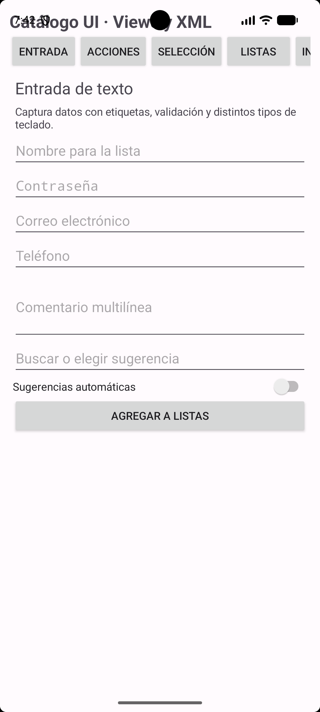 | 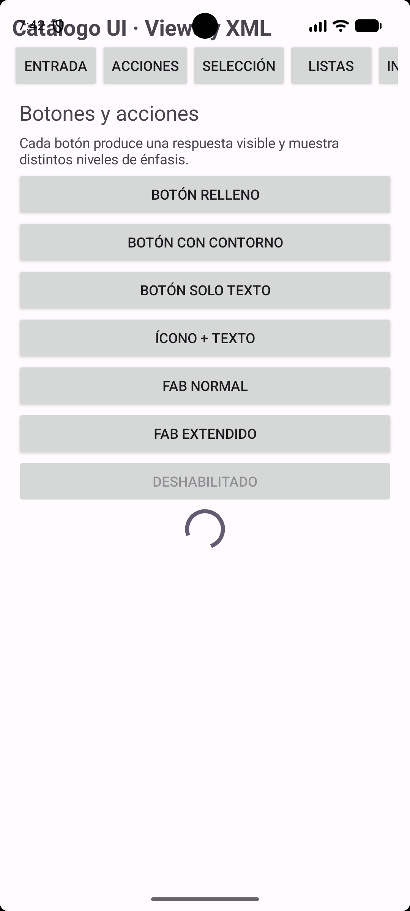 | 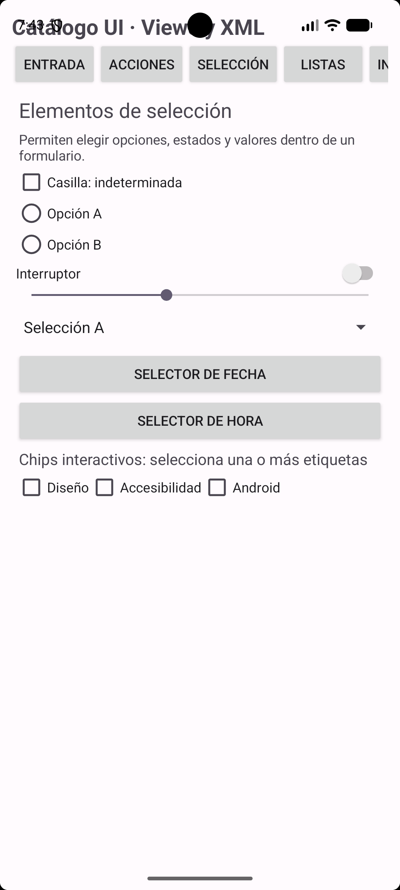 |

| Listas | Información | Estructura |
| --- | --- | --- |
| 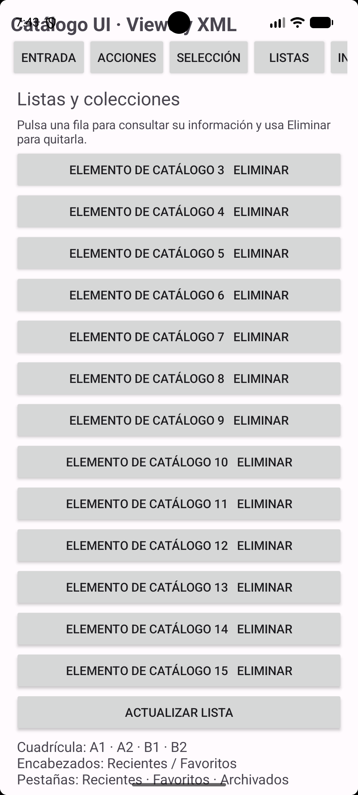 | 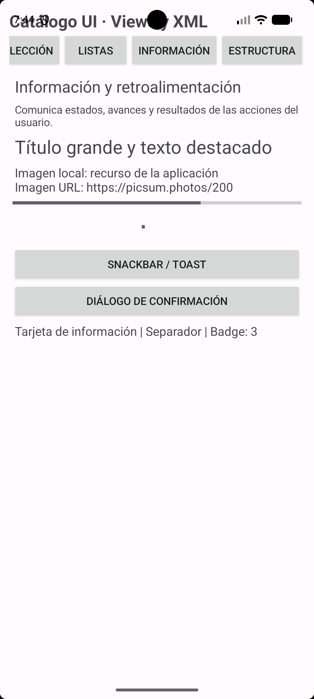 | 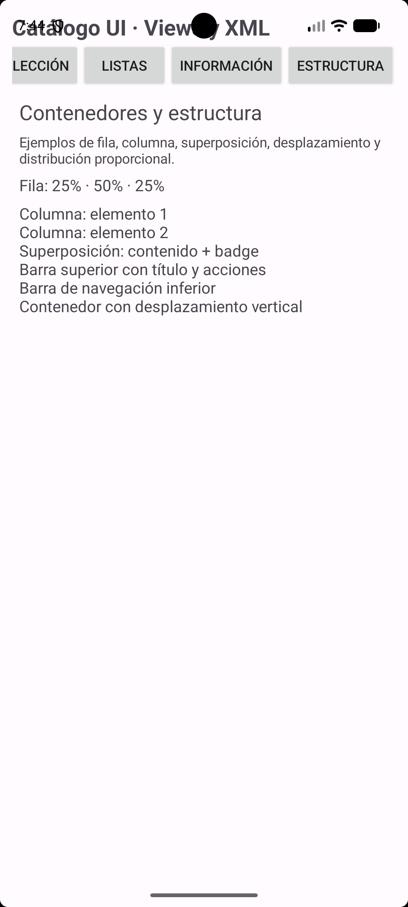 |

### Jetpack Compose

| Entrada | Acciones | Selección |
| --- | --- | --- |
| 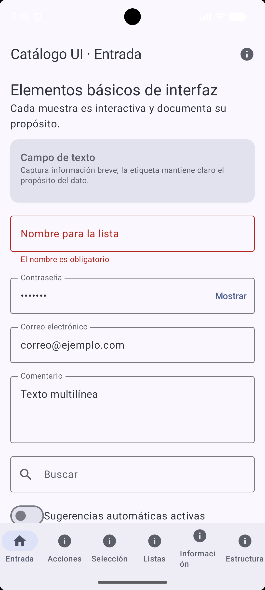 | 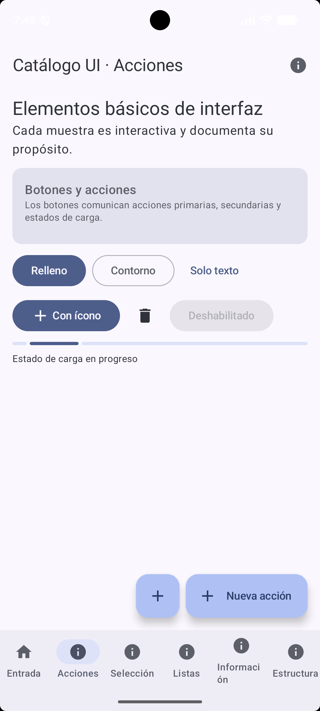 | 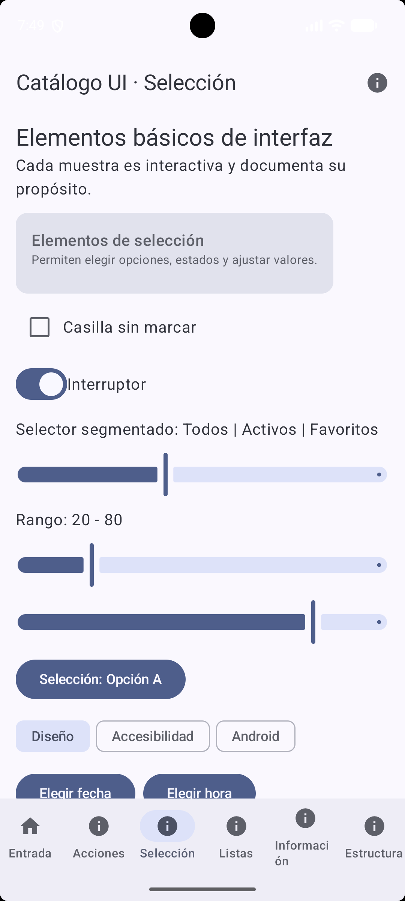 |

| Listas | Información | Estructura |
| --- | --- | --- |
| 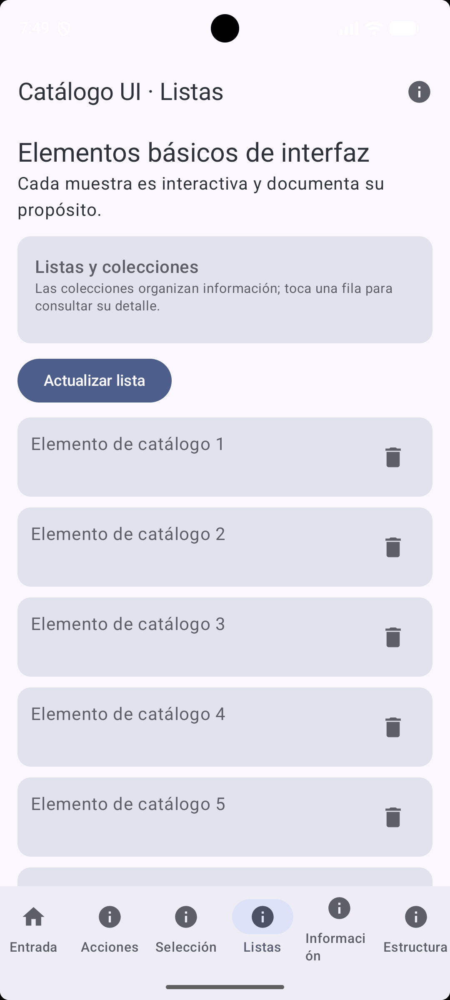 | 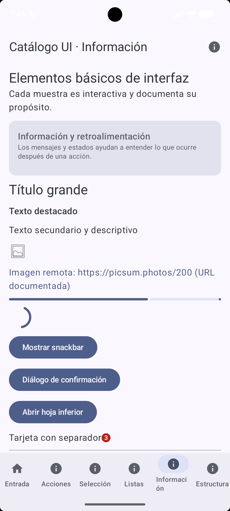 | 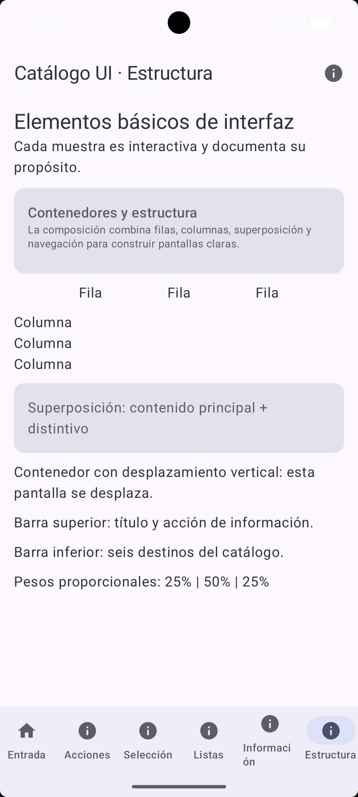 |

### Flutter

| Entrada | Acciones | Selección |
| --- | --- | --- |
| 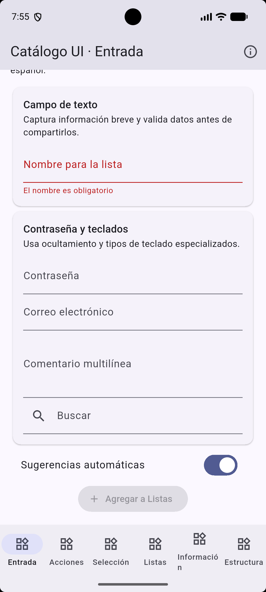 | 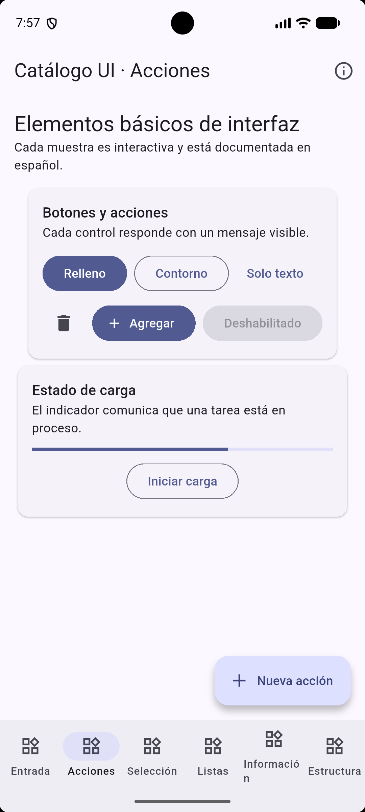 | 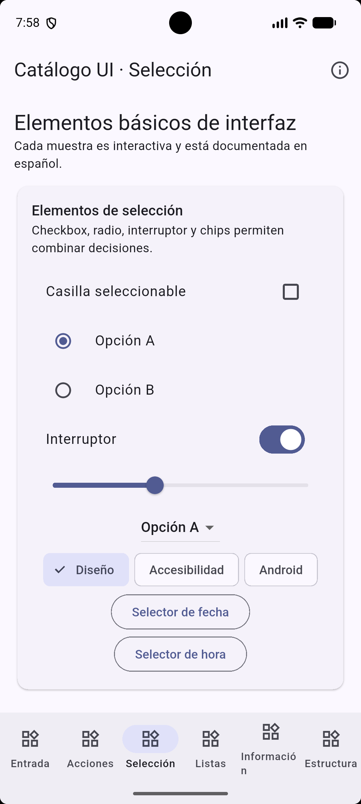 |

| Listas | Información | Estructura |
| --- | --- | --- |
| 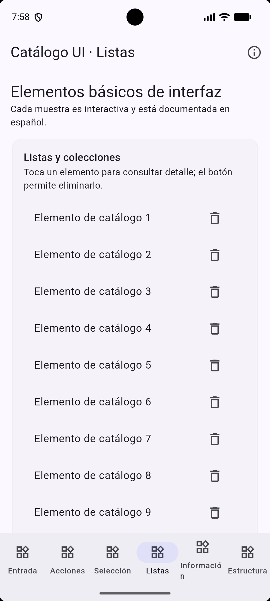 | 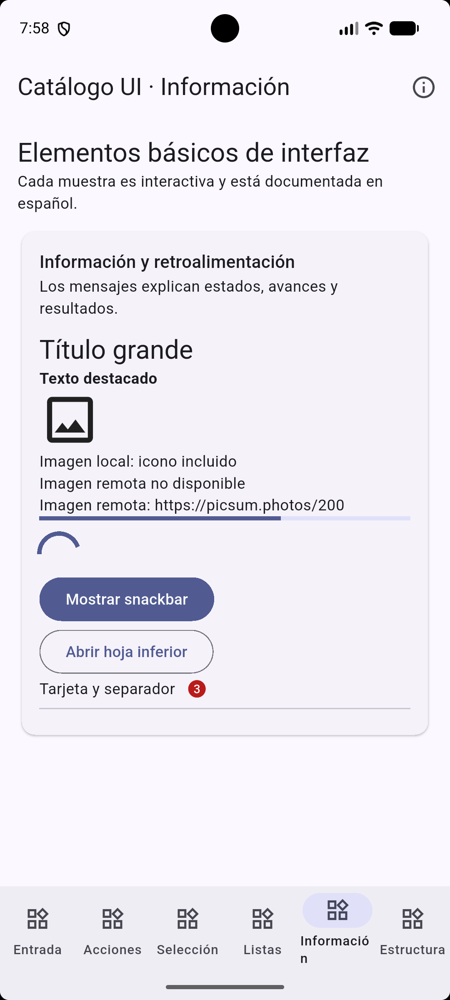 | 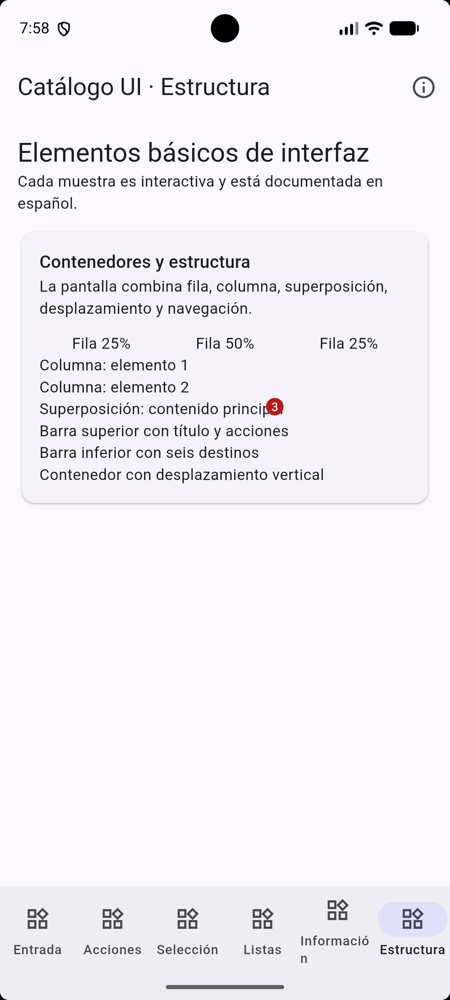 |


## Reflexión final

Compose resultó el más rápido para expresar estados y navegación porque permite mantener la interfaz cerca del estado que la controla. Views/XML separa con claridad layout y lógica, pero requiere más código de conexión. Flutter ofrece widgets consistentes y buena productividad, aunque sus equivalencias con componentes nativos deben documentarse. La decisión final depende del producto: elegiría Compose para una aplicación Android nueva, Flutter para compartir código entre plataformas y Views/XML cuando se necesite mantener una base Android tradicional.

## Referencias

- Android Developers. (2026). *Jetpack Compose documentation*. <https://developer.android.com/jetpack/compose>
- Android Developers. (2026). *Build a responsive UI with Views*. <https://developer.android.com/develop/ui/views/layout/constraint-layout>
- Flutter. (2026). *Flutter documentation*. <https://docs.flutter.dev/>
- Material Design. (2026). *Material Design 3*. <https://m3.material.io/>
